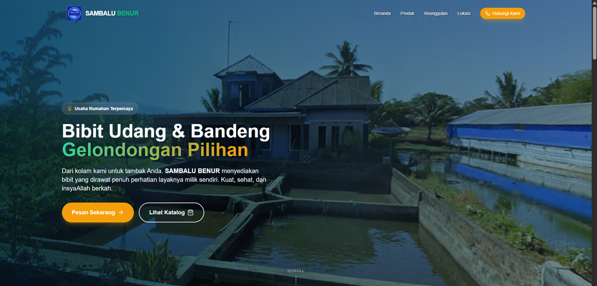

# 🦐 SAMBALU BENUR - Official Website



**SAMBALU BENUR** adalah landing page modern untuk usaha distribusi bibit udang (Benur) dan ikan (Nener) yang berlokasi di Pangkep, Sulawesi Selatan. Website ini dirancang untuk kecepatan, kemudahan akses mobile, dan konversi tinggi ke WhatsApp.

## ✨ Fitur Utama

- **⚡ High Performance:** Dibangun dengan React + Vite untuk loading super cepat.
- **📱 Mobile First:** Desain responsif yang optimal untuk layar HP petani/petambak.
- **🎨 Modern UI/UX:** Menggunakan Tailwind CSS dengan sentuhan *Glassmorphism* dan animasi halus.
- **📍 Integrasi Peta:** Embed Google Maps akurat ke lokasi hatchery.
- **💬 Direct WhatsApp:** Tombol CTA yang langsung membuka chat dengan pesan pre-filled.
- **🌊 Katalog Produk:** Showcase Benur Vaname & Nener Bandeng dengan detail spesifikasi.

## 🛠️ Teknologi yang Digunakan

- **Framework:** [React 18](https://reactjs.org/) (TypeScript)
- **Build Tool:** [Vite](https://vitejs.dev/)
- **Styling:** [Tailwind CSS v3](https://tailwindcss.com/)
- **Icons:** [Lucide React](https://lucide.dev/)
- **Animation:** [Framer Motion](https://www.framer.com/motion/)

## 🚀 Cara Menjalankan Project

Ikuti langkah ini untuk menjalankan website di komputer lokal Anda:

### 1. Prasyarat
Pastikan Anda sudah menginstall [Node.js](https://nodejs.org/) (versi 18 ke atas).

### 2. Instalasi
Clone repository ini (atau download ZIP) dan masuk ke folder proyek:

```bash
# Install dependencies
npm install
```

### 3. Jalankan Mode Development
Untuk melihat website dan mengedit kode secara live:

```bash
npm run dev
```
Buka browser dan akses `http://localhost:5173`.

### 4. Build untuk Produksi
Jika ingin mengupload ke hosting (seperti Vercel/Netlify):

```bash
npm run build
```

## 📂 Struktur Folder

```
src/
├── components/     # Komponen UI (Navbar, Hero, ProductCard, dll)
├── components/ui/  # Komponen dasar reusable (Button, Card)
├── App.tsx         # Layout utama
├── index.css       # Global styles & Tailwind directives
└── types.ts        # Definisi tipe data TypeScript
public/
└── images/         # Aset gambar (Logo, Hero, Produk)
```

## 📝 Lisensi

Hak Cipta © 2026 SAMBALU BENUR. All rights reserved.